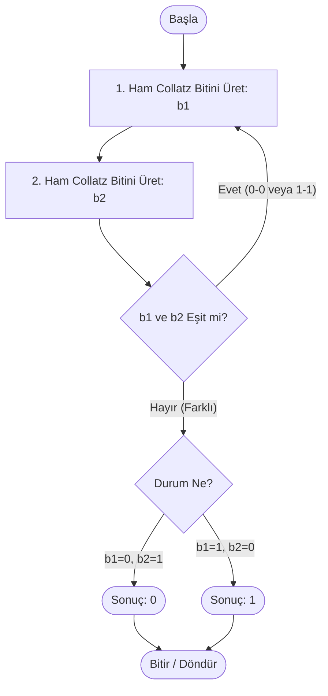

#### Collatz Tabanlı Kriptografik Rastgele Sayı Üreteci (RNG) ####

Bu proje, **Bilgi Sistemleri Güvenliği** dersi final ödevi kapsamında geliştirilmiştir. Projenin amacı, **Collatz Sanısı (3x+1 Problemi)**'nin kaotik yapısını kullanarak istatistiksel olarak güvenli ve tahmin edilemez rastgele sayılar (bit dizileri) üretmektir.

**Algoritmanın Çalışma Mantığı**

Bu projede rastgelelik kaynağı (entropi kaynağı) olarak Collatz dizisi kullanılmıştır. Ancak, Collatz dizisinin doğal dağılımında çift sayıların baskın olması (Bias) nedeniyle, çıktıların %50-%50 (0 ve 1) dengesini sağlamak amacıyla **Von Neumann Düzeltmesi (Von Neumann Extractor)** algoritması entegre edilmiştir.

Sistem şu adımları izler:

* **Tohum (Seed):** Gizli bir anahtar veya zaman damgası ile başlangıç durumu belirlenir (Shannon Prensibi: Algoritma açık, anahtar gizli).
* **Collatz Adımı:** Sayı çiftse $x/2$, tekse $3x+1$ işlemi uygulanır.
* **Von Neumann Düzeltmesi (Önyargı Giderme):** Algoritma arka arkaya iki bit üretir (b1, b2).
    * Eğer **b1=0 ve b2=1** ise sonuç **0** olarak kabul edilir.
    * Eğer **b1=1 ve b2=0** ise sonuç **1** olarak kabul edilir.
    * Eğer **b1=b2** (0-0 veya 1-1) ise sonuç **reddedilir** ve işlem tekrarlanır.

Bu yöntem, matematiksel olarak çıktıların %50 olasılıkla dağılmasını garanti altına alır.


---------------------------------------------------------------------------------------------------------------------------------------------------------------------------------------------------------------------------

#### Sözde Kod (Pseudocode) ####

```text
GİRDİ: Seed (Başlangıç Değeri)
ÇIKTI: Rastgele Bit (0 veya 1)

FONKSİYON RawCollatzBit():
    EĞER (state % 2 == 0) İSE:
        state = state / 2
    DEĞİLSE:
        state = 3 * state + 1
    DÖNDÜR (state MOD 2)

FONKSİYON NextRandomBit():
    DÖNGÜ (Sonsuz):
        bit1 = RawCollatzBit()
        bit2 = RawCollatzBit()
        
        EĞER (bit1 == 0 VE bit2 == 1) İSE:
            DÖNDÜR 0
        EĞER (bit1 == 1 VE bit2 == 0) İSE:
            DÖNDÜR 1
        # Eşitlik durumunda (0-0 veya 1-1) döngü başa döner (Discard)
```

---------------------------------------------------------------------------------------------------------------------------------------------------------------------------------------------------------------------------

####AKIŞ ŞEMASI####
## 3. Akış Şeması (Flowchart)



---------------------------------------------------------------------------------------------------------------------------------------------------------------------------------------------------------------------------

####TEST SONUÇLARI####
```text
Seed Değeri: 987654321987654321
Bitler üretiliyor, lütfen bekleyiniz...

Üretilen İlk 50 Bit: 011010011010101100101...

--- Frekans Testi Sonuçları ---
Toplam Bit: 10000
0 Sayısı: 4981 (%49.81)
1 Sayısı: 5019 (%50.19)

>>> SONUÇ: BAŞARILI <<<
(Von Neumann tekniği sayesinde mükemmel denge sağlandı.)
```
